# Revisão do conteúdo de Javascript

## Variáveis

declaração de variáveis

  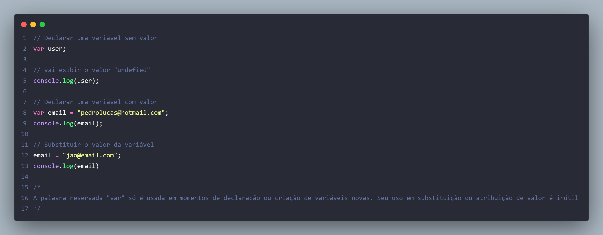
  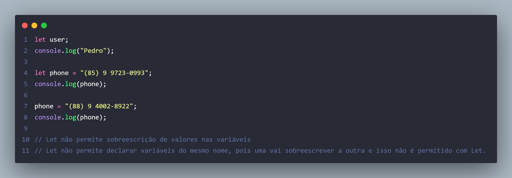
  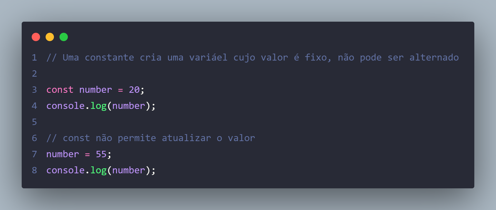

### Dicas para declarar uma variável

  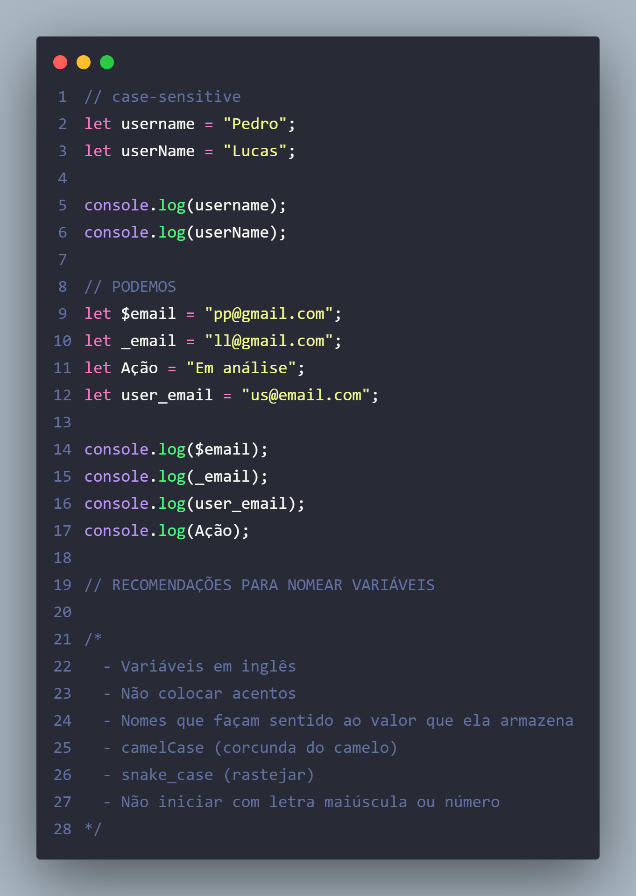

### Escopo e Hoisting

  

Hoisting trata-se de chamar uma função ou variável antes de criá-la. A melhor prática é fazer o inverso. OBS: let e const não são içados.
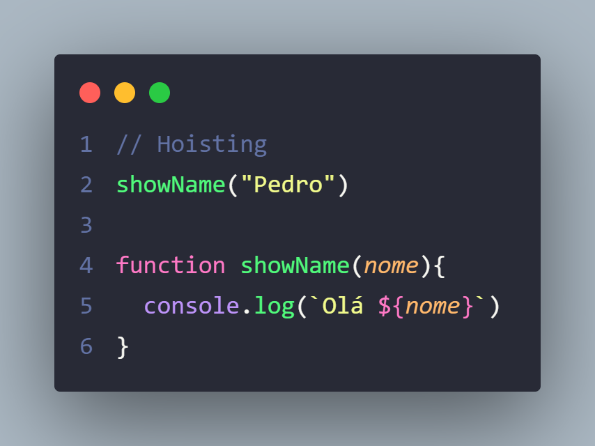

## Tipos de dados

Tipo String

  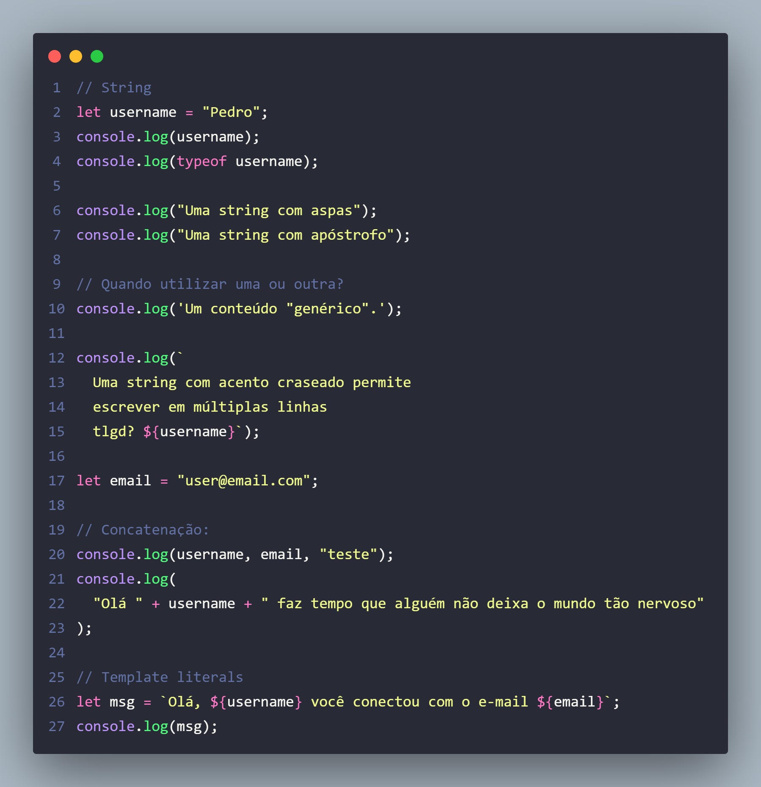

Tipo Number

  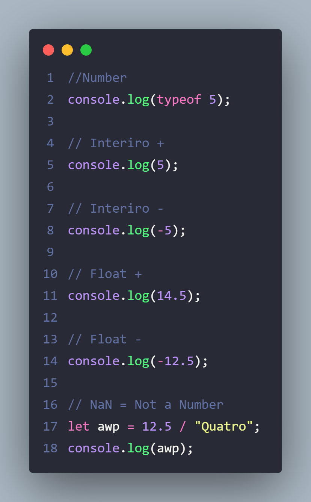

Tipo Boolean

  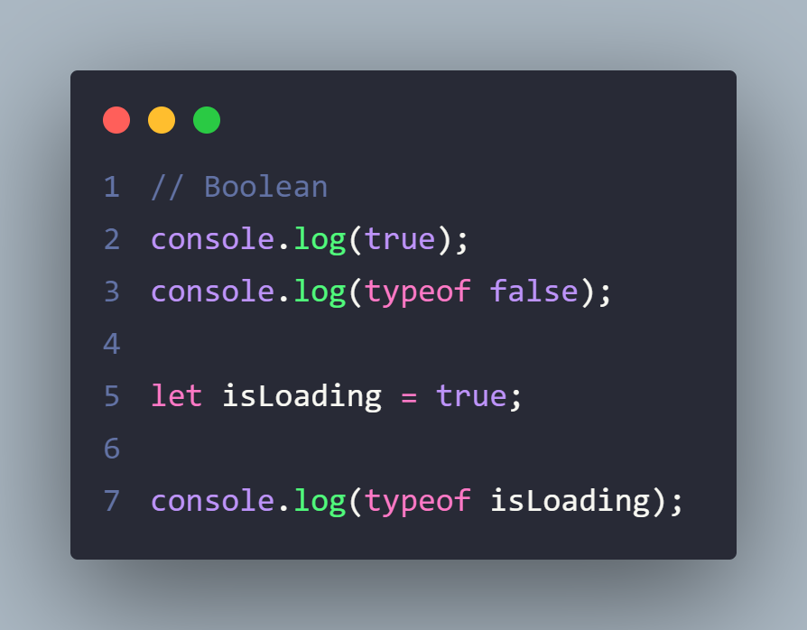

Tipo Undefined vs Null

  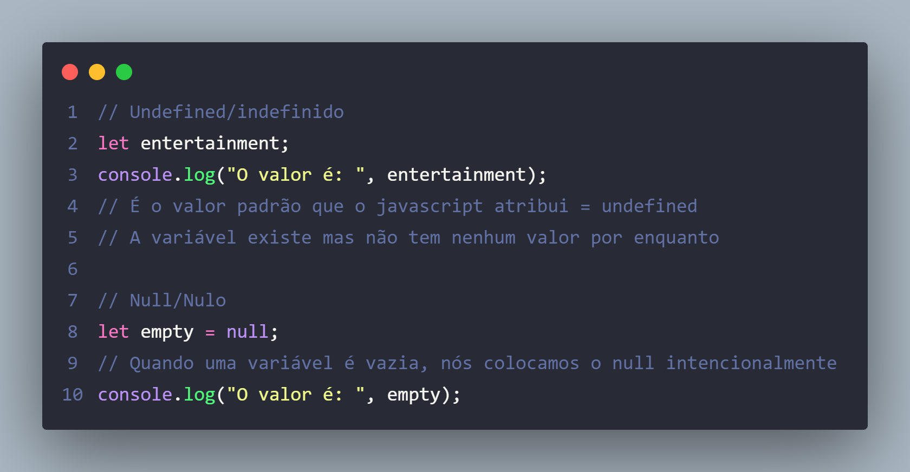

### Conversão e Coersão de tipos

Conversão de tipos, ocorre quando nós transformamos um valor de um tipo para outro, conscientemente usando o `typecasting`.

  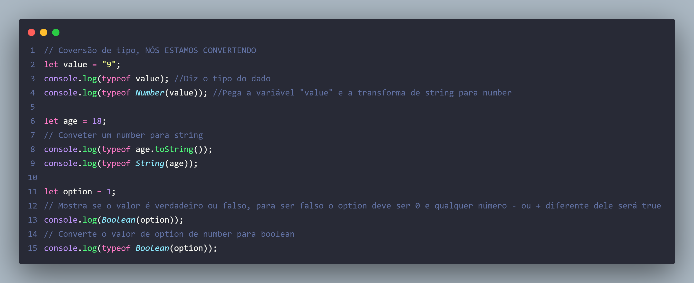

Coerção de tipos, ocorre de forma automática pelo javascript, quando por exemplo uma string "10" somando com number 5 mas por serem de tipos diferentes o sinal de + vai concatená-los e vai transformar o 5 de number para string automaticamente, exinbindo no final "105"

  

## Expressão e Operadores

Aritméticos

  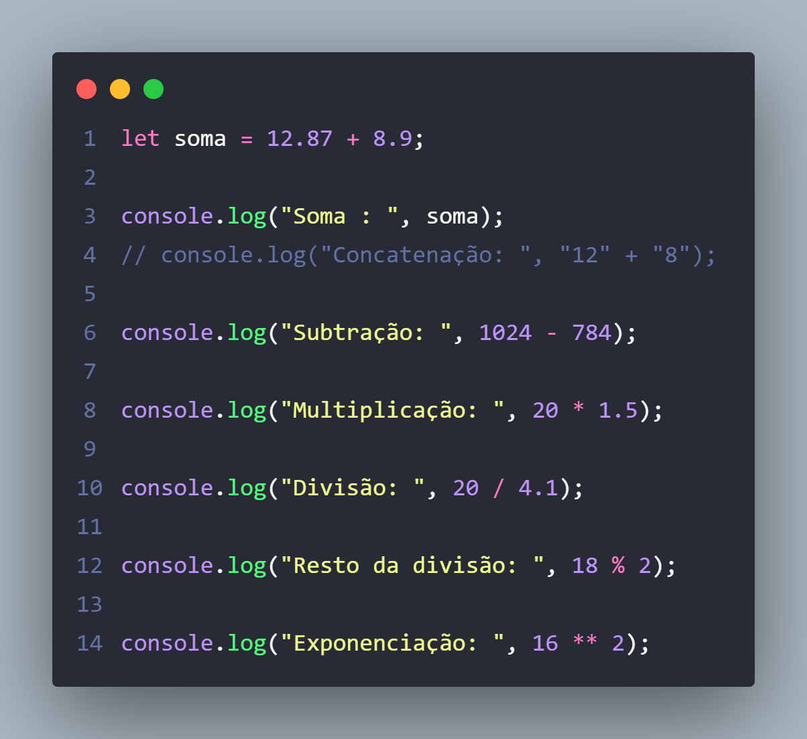

Incrementar ou Decrementar

  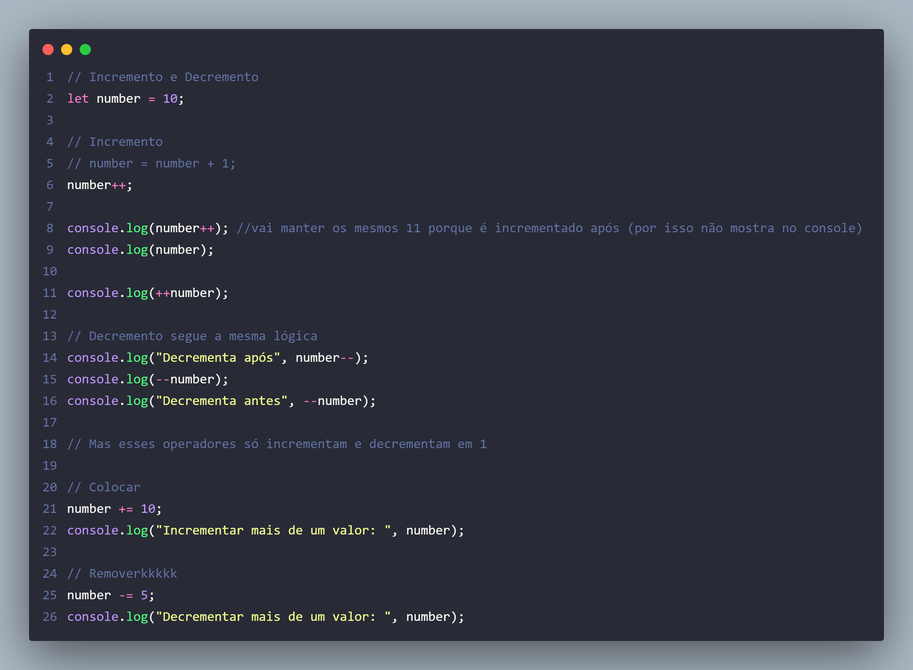

Gruoping Operator

  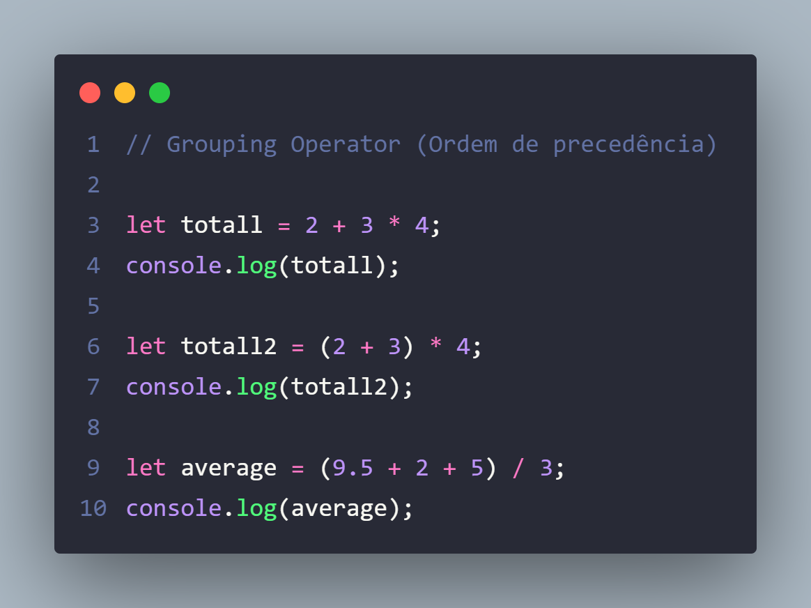

Operadores relacionais

  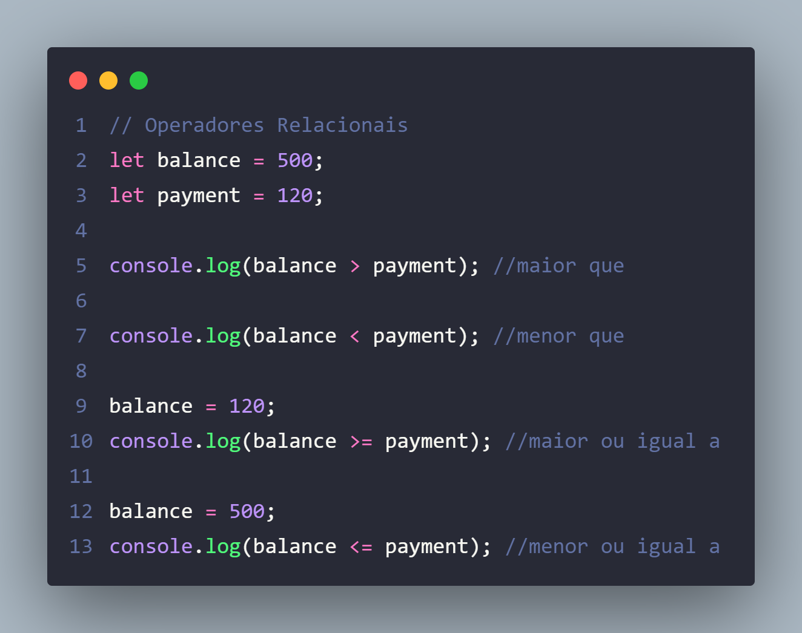
  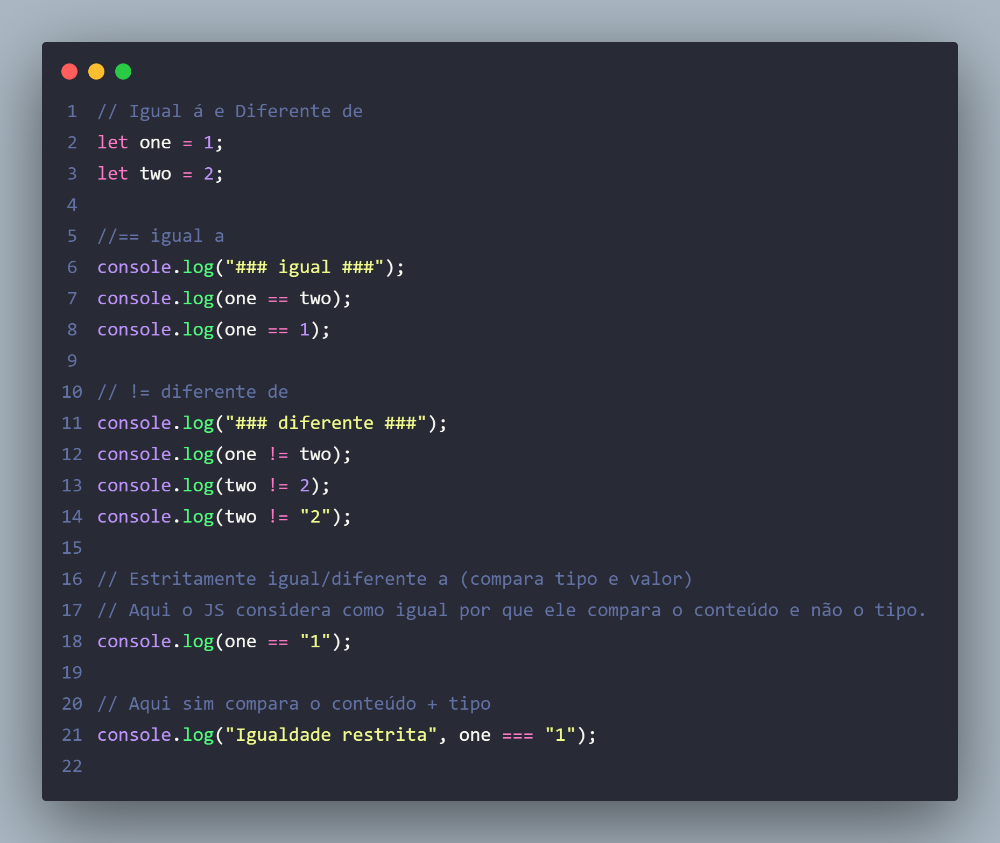

Operadores Lógicos

  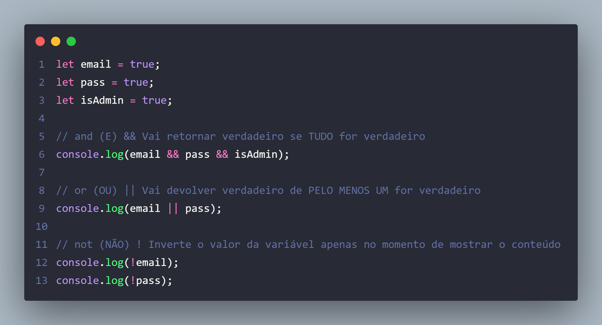

