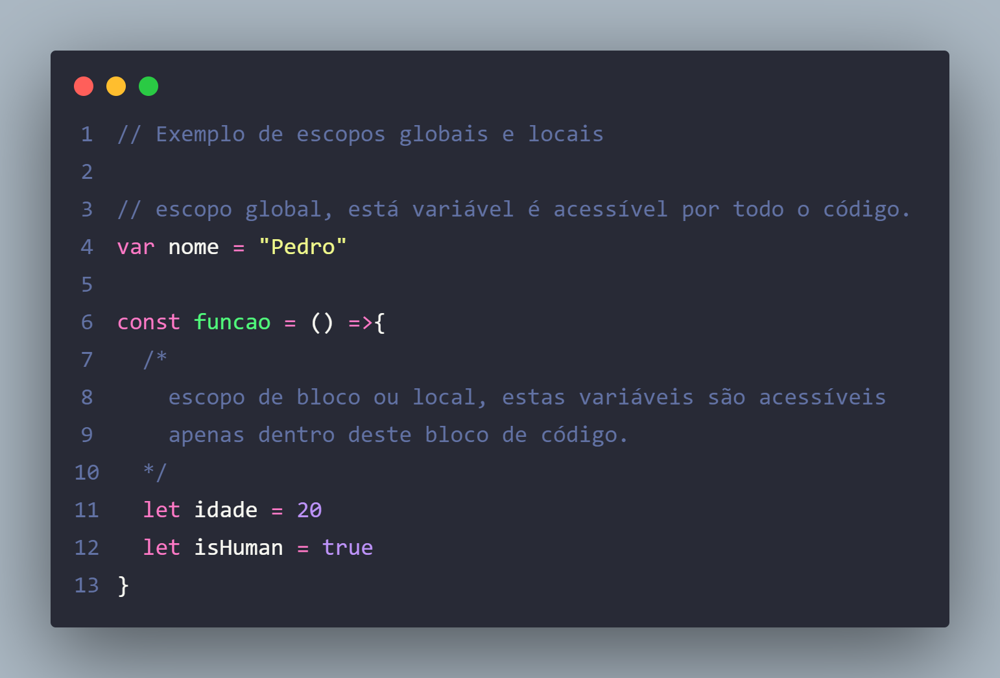
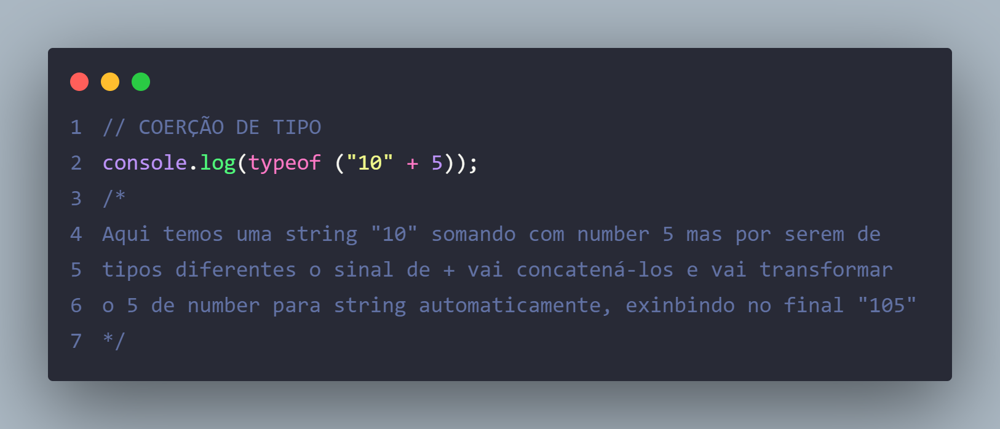

# Revisão do conteúdo de Javascript

## Variáveis

declaração de variáveis

<p>
  
  
  
</p>

### Dicas para declarar uma variável

<p>
  
</p>

### Escopo e Hoisting

<p>
  

Hoisting trata-se de chamar uma função ou variável antes de criá-la. A melhor prática é fazer o inverso. OBS: let e const não são içados.


</p>

## Tipos de dados

Tipo String

<p>
  
</p>

Tipo Number

<p>
  
</p>

Tipo Boolean

<p>
  
</p>

Tipo Undefined vs Null

<p>
  
</p>

### Conversão e Coersão de tipos

Conversão de tipos, ocorre quando nós transformamos um valor de um tipo para outro, conscientemente usando o `typecasting`.

<p>
  
</p>

Coerção de tipos, ocorre de forma automática pelo javascript, quando por exemplo uma string "10" somando com number 5 mas por serem de tipos diferentes o sinal de + vai concatená-los e vai transformar o 5 de number para string automaticamente, exinbindo no final "105"

<p>
  
</p>

## Expressão e Operadores

Aritméticos

<p>
  
</p>

Incrementar ou Decrementar

<p>
  
</p>

Gruoping Operator

<p>
  
</p>

Operadores relacionais

<p>
  
  
</p>

Operadores Lógicos

<p>
  
</p>

## Estruturas de Condição

Estruturas de Condição são blocos de código que permitem o sistema tomar decisões com base em um teste lógico de verdadeiro ou falso. Se for verdadeiro executa um bloco de comando, se for falso executa outro.

### Operador Condicional Ternario

<p>
  
</p>

### Falsy e Truthy

São valores que o Javascript considera como verdadeiros ou falsos.
É só copiar e executar no console.

```
//FALSY E TRUTHY, valores que são considerados verdadeiros ou falsos
console.log("### EXEMPLOS DE FALSY ###");
// FALSY são valores que são considerados "false"

console.log(false ? "Verdadeiro" : "Falso");
console.log(0 ? "Verdadeiro" : "Falso");
console.log(-0 ? "Verdadeiro" : "Falso");
console.log("" ? "Verdadeiro" : "Falso");
console.log(null ? "Verdadeiro" : "Falso");
console.log(undefined ? "Verdadeiro" : "Falso");
console.log(NaN ? "Verdadeiro" : "Falso");

console.log("### EXEMPLOS DE TRUTHY ###");
// TRUTHY são valores que são considerados "verdadeiro"

console.log(true ? "Verdadeiro" : "Falso");
console.log({} ? "Verdadeiro" : "Falso"); //Objeto vazio é considerado como true
console.log([] ? "Verdadeiro" : "Falso"); //Array vazio tbm é considerado como true
console.log(1 ? "Verdadeiro" : "Falso");
console.log(3.14 ? "Verdadeiro" : "Falso");
console.log("Pedro Lucas" ? "Verdadeiro" : "Falso");
console.log(" " ? "Verdadeiro" : "Falso");
console.log(-1 ? "Verdadeiro" : "Falso");
console.log(Infinity ? "Verdadeiro" : "Falso");
console.log(-Infinity ? "Verdadeiro" : "Falso");
```

### IF, ELSE, ELSE IF

```
IF (SE)

let hour = 11;
"if (hour <= 12) {
  console.log("Bom dia");
  console.log("Bem vindo");
}"

Neste formato, se a condição for atendida então será executado os
comandos dentro de if e fluxo do algoritmo seguirá normalmente.

"if (hour >= 9) console.log("Só vai executar essa linha de comando");"

Também é possível usar essa estrutura sem as {} quando precisar
executar apenas uma linha.

IF ELSE (SE NÃO)

let age = 19;
"if (age < 18) {
  console.log("voce nao vai dirigir");
} else {
  console.log("voce pode dirigir");
}"

Executa uma coisa ou outra, caso o IF não seja atendido então será
executado o escopo do ELSE e vice versa.

IF ELSE IF

let hora = 15;
"if (hora < 12 && hora > 5) {
  console.log("Bom dia");
} else if (hora >= 12 && hora < 18) {
  console.log("Boa tarde");
} else if (hora < 5) {
  console.log("É de madrugada vagabundo");
} else {
  console.log("Boa noite");
}"

Se uma das condições for verdadeiras então nem olhe para o restante
```

### Switch Case

<p>
  
</p>

### Tratamento de erros, Try Catch

<p>
  
</p>

## Funções

Funções são blocos de código reutilizável que calculam ou executam alguma instrução pré programada.